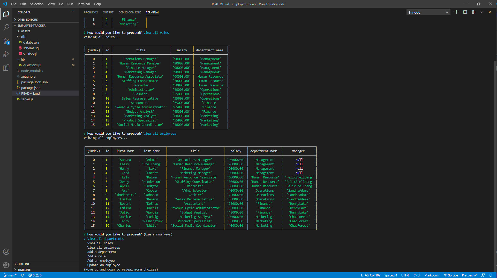

# SQL Challenge: Employee Tracker

### UCF Coding Boot-Camp Module 12 Challenge

## Description

This is a command-line application that assists the user in managing a company's employee database, using Node.js, Inquirer, and MySQL.

## Table of Contents

- [Description](#Description)
- [Installation](#Installation)
- [Usage](#Usage)
- [Features](#Features)
- [Production](#Production)
- [Questions](#Questions)
- [Contribution](#Contribution)

 

## Installation

- Clone down the application code from GitHub.
- Install [MySQL](https://www.mysql.com/downloads/) in order to have access to their open source relational database management system.
- Please ensure you have a node.js integrated terminal before proceeding. If not:
- Download [Node](https://nodejs.org/en/).
- Inside root directory terminal, run 'npm init'.
- Inside root directory terminal, run 'npm install inquirer' to install [Inquirer](https://www.npmjs.com/package/inquirer#installation) to interact with the user via command-line.
- Inside root directory terminal, run 'npm install --save mysql2' to install [MySQL 2](https://www.npmjs.com/package/mysql2) and connect user MySQL database to perform queries in this application.
- Inside root directory terminal, run 'npm install console.table --save' to install [console.table](https://www.npmjs.com/package/console.table) to print MySQL rows to the console.
- Inside root directory terminal, run 'node server.js' to activate application.

## Usage

-
- Please review video of application [demo]().

## Features

- features

## Production

[employee-tracker](https://Elysiayn.github.io/employee-tracker/)

## Questions

Please feel free to reach me for additional questions at:
 
Email: Wendy.Lemus.WL@gmail.com

Visit my GitHub!
 
GitHub: [Elysiayn](https://github.com/Elysiayn)

### Contributions

- [Elysiayn](https://github.com/Elysiayn)
